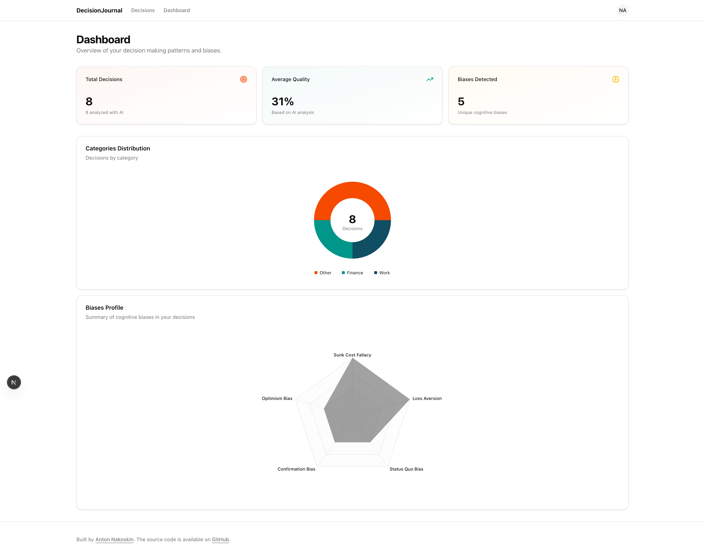
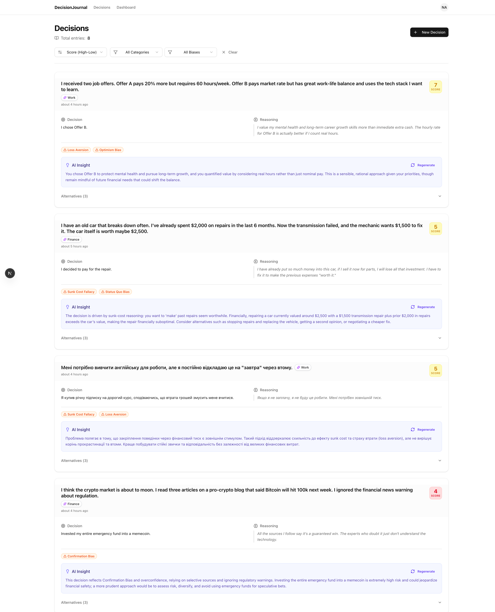

<div style="text-align: center">

# 🧠 Decision Journal

**AI-powered decision tracking and analysis platform**

[](https://nextjs.org/)
[](https://www.typescriptlang.org/)
[](https://supabase.com/)
[](https://openai.com/)

[Demo](https://decision-journal-gamma.vercel.app/) · [Features](#-features) · [Getting Started](#-getting-started) · [Tech Stack](#-tech-stack)

</div>

---

## 📋 Overview

Decision Journal is a modern web application designed to help users track, analyze, and improve their decision-making process. Leveraging AI capabilities, the platform provides insightful analysis of each decision, identifies potential cognitive biases, and suggests alternative approaches.

## ✨ Features

### Core Functionality

- **📝 Decision Tracking** — Record decisions with Situation, Decision Made, and Why? (Reasoning)
- **🤖 AI Analysis** — Automatic analysis using GPT-5 to evaluate decision quality
- **📊 Rationality Score** — 1-10 score rating for each decision
- **🧪 Bias Detection** — Identification of potential cognitive biases (Confirmation Bias, Anchoring, Overconfidence, etc.)
- **💡 Alternative Suggestions** — AI-generated alternative courses of action
- **🔄 Regenerate Analysis** — Ability to regenerate AI insights for any decision

### User Experience

- **🌓 Dark/Light Theme** — Full theme support with smooth transitions
- **📱 Responsive Design** — Optimized for desktop and mobile devices
- **⚡ Real-time Updates** — Live updates using Supabase Realtime
- **🔍 Filtering & Sorting** — Filter by category, bias, and sort by date or score
- **📄 Pagination** — Efficient browsing with paginated decision lists

### Security

- **🔐 Authentication** — Secure email/password authentication via Supabase Auth
- **🎫 Invite Code System** — Registration protection with invite codes
- **🛡️ Protected Routes** — Server-side route protection

## 🛠 Tech Stack

| Category           | Technology                       |
| ------------------ | -------------------------------- |
| **Framework**      | Next.js 16.1 (App Router)        |
| **Language**       | TypeScript 5                     |
| **Styling**        | Tailwind CSS 4                   |
| **UI Components**  | shadcn/ui + Radix UI             |
| **Database**       | Supabase (PostgreSQL)            |
| **Authentication** | Supabase Auth                    |
| **AI/LLM**         | OpenAI GPT-5 (via Vercel AI SDK) |
| **Charts**         | Recharts                         |
| **Validation**     | Zod                              |
| **Date Utilities** | date-fns                         |

## 📁 Project Structure

```
src/
├── app/
│   ├── (auth)/           # Authentication pages (login, register)
│   ├── (main)/           # Protected application pages
│   │   ├── decisions/    # Decisions list and creation
│   │   ├── profile/      # User profile
│   │   ├── settings/     # App settings
│   │   └── dashboard/    # Analytics dashboard
│   └── layout.tsx        # Root layout
├── components/
│   ├── auth/             # Auth-related components
│   ├── dashboard/        # Dashboard charts and stats
│   ├── decisions/        # Decision cards, forms, lists
│   ├── global/           # Header, footer, navigation
│   └── ui/               # shadcn/ui components
├── actions/              # Server actions
│   ├── auth.ts           # Authentication actions
│   ├── decisions.ts      # CRUD operations
│   └── analyze-decision.ts # AI analysis trigger
├── lib/
│   ├── supabase/         # Supabase client configuration
│   ├── schemas/          # Zod validation schemas
│   └── helpers/          # Utility functions
├── hooks/                # Custom React hooks
└── types/                # TypeScript type definitions
```

## 🚀 Getting Started

### Prerequisites

- Node.js 18+
- npm / yarn / pnpm
- Supabase account
- OpenAI API key

### Installation

1. **Clone the repository**

    ```bash
    git clone https://github.com/fxyxx/decision-journal.git
    cd decision-journal
    ```

2. **Install dependencies**

    ```bash
    npm install
    ```

3. **Configure environment variables**

    Create a `.env.local` file in the root directory:

    ```env
    # Supabase
    NEXT_PUBLIC_SUPABASE_URL=your_supabase_url
    NEXT_PUBLIC_SUPABASE_ANON_KEY=your_supabase_anon_key

    # OpenAI
    OPENAI_API_KEY=your_openai_api_key

    # Invite Code (for registration)
    INVITE_CODE=your_secret_invite_code
    ```

4. **Set up the database**

    Run the following SQL in your Supabase SQL Editor:

    ```
    CREATE TABLE decisions (
      id UUID DEFAULT gen_random_uuid() PRIMARY KEY,
      user_id UUID REFERENCES auth.users(id) ON DELETE CASCADE,
      title TEXT NOT NULL,
      decision TEXT NOT NULL,
      reasoning TEXT,
      analysis JSONB,
      is_analyzing BOOLEAN DEFAULT FALSE,
      created_at TIMESTAMP WITH TIME ZONE DEFAULT NOW()
    );

    -- Enable Row Level Security
    ALTER TABLE decisions ENABLE ROW LEVEL SECURITY;

    -- Create policy for users to manage their own decisions
    CREATE POLICY "Users can manage their own decisions" ON decisions
      FOR ALL USING (auth.uid() = user_id);
    ```

5. **Run the development server**

    ```bash
    npm run dev
    ```

6. **Open the application**

    Navigate to [http://localhost:3000](http://localhost:3000)

## 📜 Available Scripts

| Command                 | Description                  |
| ----------------------- | ---------------------------- |
| `npm run dev`           | Start development server     |
| `npm run build`         | Build for production         |
| `npm run start`         | Start production server      |
| `npm run lint:es`       | Run ESLint                   |
| `npm run lint:prettier` | Format code with Prettier    |
| `npm run typecheck`     | Run TypeScript type checking |

## 🌐 Deployment

The application is ready for deployment on [Vercel](https://vercel.com):

1. Push your code to GitHub
2. Connect your repository to Vercel
3. Configure environment variables in Vercel dashboard
4. Deploy!

Alternatively, you can deploy to Netlify or any platform supporting Next.js.

## 🎨 Screenshots

<details>
<summary>View Screenshots</summary>

### Login

_Login page with email and password fields_


### Dashboard

_Modern dashboard with analytics and recent decisions_



### Decisions List

_Filterable and sortable list of all decisions with AI analysis_



</details>

## 📄 License

This project is created as a test assignment.
